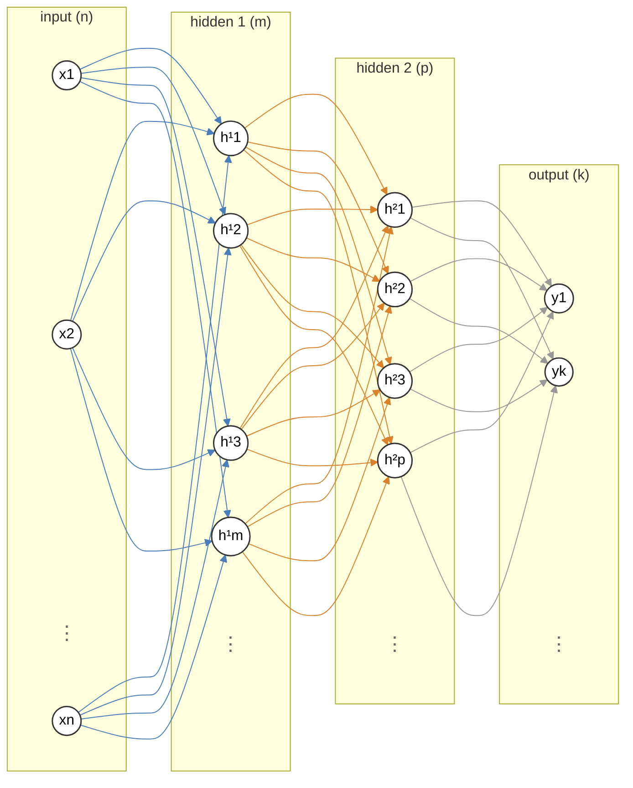

# Neural Networks

```mermaid
graph LR
    classDef neuron fill:#ffffff,stroke:#333333,stroke-width:1.5px,color:#000000;
    classDef dots fill:none,stroke:none,color:#666666,font-size:22px;

    subgraph IN["input (n)"]
        X1((x1)):::neuron
        X2((x2)):::neuron
        XD["⋮"]:::dots
        XN((xn)):::neuron
    end

    subgraph H1L["hidden 1 (m)"]
        A1((h¹1)):::neuron
        A2((h¹2)):::neuron
        A3((h¹3)):::neuron
        AD["⋮"]:::dots
        AM((h¹m)):::neuron
    end

    subgraph H2L["hidden 2 (p)"]
        B1((h²1)):::neuron
        B2((h²2)):::neuron
        B3((h²3)):::neuron
        BD["⋮"]:::dots
        BP((h²p)):::neuron
    end

    subgraph OUT["output (k)"]
        Y1((y1)):::neuron
        YD["⋮"]:::dots
        YK((yk)):::neuron
    end

    %% output -> hidden 1 (W¹: m x n)
    X1 --> A1 & A2 & A3 & AM
    X2 --> A1 & A2 & A3 & AM
    XN --> A1 & A2 & A3 & AM

    %% hidden 1 -> hidden 2 (W²: p x m)
    A1 --> B1 & B2 & B3 & BP
    A2 --> B1 & B2 & B3 & BP
    A3 --> B1 & B2 & B3 & BP
    AM --> B1 & B2 & B3 & BP

    %% Oculta 2 -> Saída (W³: k x p)
    B1 --> Y1 & YK
    B2 --> Y1 & YK
    B3 --> Y1 & YK
    BP --> Y1 & YK

    %% Ligações invisíveis para alinhar os "⋮" na coluna certa
    XD ~~~ AD ~~~ BD ~~~ YD

    %% Cores por camada de pesos
    linkStyle 0,1,2,3,4,5,6,7,8,9,10,11 stroke:#4a7ebb,stroke-width:1px;
    linkStyle 12,13,14,15,16,17,18,19,20,21,22,23,24,25,26,27 stroke:#d9822b,stroke-width:1px;
    linkStyle 28,29,30,31,32,33,34,35 stroke:#999999,stroke-width:1px;

```